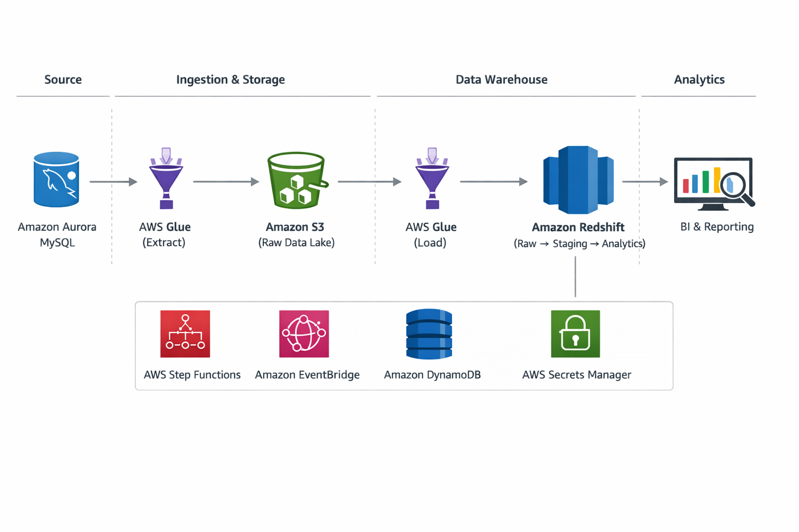

# End-to-End Data Pipeline: MySQL → S3 → Redshift (AWS)

## Tech Highlights

AWS Glue • Amazon S3 • Amazon Redshift • DynamoDB • Step Functions • EventBridge • Secrets Manager • Python • SQL • ELT Pipeline • Incremental Loading • Data Warehousing

---

## Overview

This project implements a production-grade ELT data platform that ingests operational data from Amazon Aurora (MySQL), stages it in Amazon S3 as a scalable data lake, and transforms it into analytics-ready datasets within Amazon Redshift. 
The architecture is designed to decouple OLTP and OLAP workloads, reducing pressure on transactional systems while enabling high-performance analytical processing. It leverages S3 as the central storage layer and Redshift as the compute engine, following a separation-of-concerns approach for scalability and cost efficiency. 
Incremental data loading is implemented using a stateful checkpointing mechanism (DynamoDB), ensuring idempotent and efficient data ingestion. Orchestration is handled via Step Functions, enabling controlled, modular, and fault-tolerant execution of pipeline stages. The system is built to handle growing data volumes, optimize batch processing using distributed compute (Glue), and provide a reliable foundation for downstream analytics, reporting, and data-driven decision-making.

---

## Problem Statement

* Overloaded operational databases due to analytical queries
* Slow SQL performance on transactional systems
* Poor dashboard performance and delayed insights
* Lack of separation between OLTP and OLAP workloads

---

## Architecture


```
MySQL (Aurora RDS)
        │
        ▼
AWS Glue (Extract)
        │
        ▼
Amazon S3 (Raw Layer)
        │
        ▼
AWS Glue (Load)
        │
        ▼
Amazon Redshift (Raw → Staging → Processed)
        │
        ▼
BI / Analytics / Reporting
```

---

## AWS Services Used

| Service                   | Role                                             |
| ------------------------- | ------------------------------------------------ |
| Amazon Aurora MySQL (RDS) | Source system storing operational data           |
| Amazon S3                 | Raw data lake storage (landing zone)             |
| AWS Glue                  | ETL processing (extraction and loading)          |
| Amazon Redshift           | Data warehouse for transformations and analytics |
| AWS Secrets Manager       | Secure storage of database credentials           |
| AWS Step Functions        | Orchestration of pipeline workflow               |
| Amazon EventBridge        | Scheduling pipeline execution                    |
| Amazon DynamoDB           | Tracks incremental load state                    |
| AWS IAM                   | Secure access control across services            |

---

## Pipeline Flow

### 1. Extraction (MySQL → S3)

* Data is extracted from Aurora MySQL using AWS Glue
* Incremental logic is applied using timestamp columns
* Data is written to Amazon S3 as raw files

### 2. Raw Layer (S3)

* Stores unprocessed source data
* Acts as a single source of truth
* Supports reprocessing and replay

### 3. Load (S3 → Redshift)

* Data is loaded into Redshift using the `COPY` command
* Stored in `raw_zone` schema

### 4. Transformation (Inside Redshift)

Data flows through structured layers:

```
Raw → Staging → Processed
```

Transformations include:

* Deduplication using window functions
* Incremental upserts using `MERGE`
* Data standardisation and cleaning
* Aggregations for analytics

### 5. Serving Layer

* Processed data is optimised for dashboards and reporting
* Supports fast analytical queries

---

## Incremental Loading Strategy

* DynamoDB stores the last successfully processed timestamp
* Extraction queries filter using:

  ```
  WHERE updated_at > last_extracted_value
  ```
* After successful processing, the timestamp is updated
* Ensures efficient, idempotent data loads

---

## Data Model (Redshift)

### Raw Layer

```
raw_zone.apartments
raw_zone.apartment_attributes
raw_zone.apartment_viewings
```

### Staging Layer

* Cleaned and deduplicated intermediate datasets

### Processed Layer

* **dim_apartments** → apartment metadata
* **dim_users** → user reference data
* **fact_apartment_viewings** → user interaction events

---

## Project Structure

```
glue/
    mysql-extraction.py
    redshift-raw-ingestion.py
    redshift-processed-layer.py

step_functions/
    pipeline.json

mysql/
    ddl.sql
    transformations.sql
    mysql-queries.sql
```

---

## Technologies Used

* Python (Glue scripts, orchestration logic)
* SQL (Redshift transformations, MERGE, analytics)
* boto3 (AWS SDK integration)
* AWS Glue Python Shell

---

## Best Practices Applied

* Batch loading using S3 + `COPY` (avoids row-by-row inserts)
* Separation of storage and compute (S3 + Redshift)
* Use of staging tables for safe transformations
* Incremental loading for efficiency
* Modular pipeline design for scalability
* Secure credential handling via Secrets Manager

---

## Monitoring & Observability

* AWS CloudWatch for Glue job logs
* Step Functions execution tracking
* Error handling and retry mechanisms
* Logging implemented across pipeline stages

---

## Example Use Cases

* User activity tracking
* Operational performance analytics
* Cost and usage reporting
* Event-driven analytics

---

## How to Run

1. Configure AWS credentials and IAM roles
2. Grant Glue permissions to S3, CloudWatch, and DynamoDB
3. Store database credentials in AWS Secrets Manager
4. Deploy Glue jobs (extraction and ingestion)
5. Configure Step Functions workflow
6. Schedule execution using EventBridge
7. Monitor pipeline via CloudWatch and Step Functions

---

## Future Improvements

* Implement Slowly Changing Dimensions (SCD Type 2)
* Add data quality validation layer
* Introduce partitioning strategy in S3
* Integrate BI dashboards (e.g., QuickSight)
* Add CI/CD pipeline for deployment

---

## One-line Summary

A scalable, production-style AWS data pipeline that ingests data from MySQL, stages it in S3, and transforms it in Redshift using incremental ELT principles.
